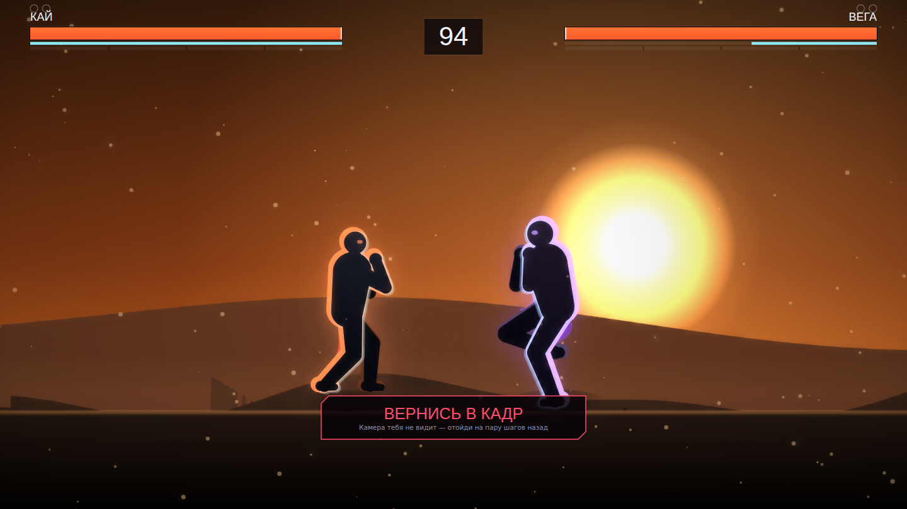

# SHADOWSTRIKE

**Файтинг, в котором контроллер — это ты.**

Камера смотрит на тебя, распознаёт удары, прыжки, уклонения и блоки — и в ту
же секунду их повторяет твой боец на экране. Бой идёт как в теневом поединке:
слева твой силуэт, справа противник.

### ▶ Играть прямо сейчас: **https://diawx-6669.github.io/fight/**

Ничего устанавливать не нужно — открой ссылку и разреши камеру. Встань в двух
шагах от экрана, пройди калибровку (8 секунд) и бей.

Если экран чёрный или игра тормозит — открой
[?safe=1](https://diawx-6669.github.io/fight/?safe=1): это простая графика,
она запускается везде.



---

## Что уже работает

| | |
|---|---|
| **Тело как контроллер** | 33 точки скелета с камеры → джеб, кросс, хук, апперкот, оверхед, лоу/мид/хай-кик, тип, колено, прыжок, присед, уклон, блок, парирование |
| **Мокап в реальном времени** | Боец не проигрывает готовую анимацию — он *носит твою руку*. Хитбоксы снимаются с живого рига, поэтому короткий джеб реально бьёт ближе полного кросса |
| **Управление руками** | Меню, настройки, выбор бойца и ввод кода комнаты — указательным пальцем и щипком, без мыши |
| **Калибровка под тебя** | 8 секунд замеров: рост, размах, расстояние до камеры, уровень шума. Без неё пороги врут для всех, кроме одного человека |
| **6 бойцов** | Разные статы, пропорции, палитры и характеры ИИ |
| **6 арен** | Полностью процедурные: небо, параллакс, туман, погода (дождь, снег, угли, лепестки, пыль) |
| **ИИ с реакцией человека** | 5 уровней. Даже «Кошмар» реагирует за 8 кадров (~130 мс), а не мгновенно |
| **Онлайн** | Быстрый бой или игра по коду комнаты с другом; две камеры одновременно |
| **Звук из воздуха** | Ни одного звукового файла — все удары и музыка синтезируются на лету |

---

## Быстрый старт

```bash
npm install
npm run dev
```

Открой **http://localhost:5173** и разреши доступ к камере.

> Браузер отдаёт камеру только в защищённом контексте: `https://` или
> `localhost`. По `http://` с другого устройства камера не заработает.

### Онлайн

Нужен релей-сервер — он же раздаёт собранную игру:

```bash
npm run build     # собрать клиент
npm run server    # http://localhost:8787
```

Или всё сразу в режиме разработки:

```bash
npm start         # vite + сервер параллельно
```

### Работа без интернета

`npm run build` уже кладёт рядом с игрой WASM-рантайм распознавания. Модели и
шрифты качаются отдельно, потому что для них нужен интернет **один раз**, на
машине сборки:

```bash
npm run assets   # рантайм + модели + шрифты
```

После этого игра не обращается наружу вообще: ни к `cdn.jsdelivr.net`, ни к
`storage.googleapis.com`, ни к `fonts.googleapis.com`. Это не про офлайн-режим
ради офлайна — эти адреса заблокированы во многих сетях, и там игра открывала
камеру, показывала превью и не распознавала ровным счётом ничего. Для игры про
камеру это худший из возможных отказов, и выглядит он как «игра не работает».

Деплой на Pages делает то же самое сам — шаг `Модели и рантайм распознавания` в
`.github/workflows/deploy.yml`.

---

## Как играть

Встань **в 2–3 шагах от камеры**, так чтобы в кадр помещалось всё тело
целиком — ноги нужны для ударов ногами.

| Что сделать телом | Что произойдёт в игре |
|---|---|
| Резко выпрямить руку вперёд | Прямой удар (джеб передней, кросс задней) |
| Широкий боковой замах | Хук — обходит высокий блок |
| Удар снизу вверх | Апперкот — подбрасывает противника |
| Удар сверху вниз | Оверхед — пробивает присед |
| Выбросить ногу | Кик. Высота ноги решает: лоу / мид / хай |
| Подпрыгнуть | Прыжок |
| Присесть | Присед — уходит от высоких ударов |
| Резко качнуть корпусом вбок | Уклон с кадрами неуязвимости |
| Поднять руки к лицу | Блок. Высота рук = высота блока |
| Из блока резко развести руки | Парирование — соперник открыт |
| Шагнуть к камере / от камеры | Боец идёт вперёд / отходит назад |
| Шагнуть влево/вправо | Боец идёт в ту же сторону по экрану |

**Меню руками:** указательный палец — курсор, щипок (большой + указательный) —
выбор. Если щипок не ловится (плохой свет), задержи курсор на кнопке — она
нажмётся сама. Открытая ладонь ~1 секунду — «назад».

**Клавиатура** работает как запасной вариант: `J/K/L/U/I` — руки,
`N/M/,/./ /` — ноги, `Пробел` — прыжок, `A/D` — шаги, `S` — присед,
`Shift` — блок, `Esc` — пауза.

---

## Если что-то не так

| Симптом | Что делать |
|---|---|
| Удары не засчитываются | Пройди **Калибровку**. Потом подними чувствительность в настройках |
| Засчитывается лишнее | Понизь чувствительность |
| «Вернись в кадр» | Отойди назад: в кадре должны быть ноги |
| Дёргается боец | Добавь света. Показатель качества — полоска под превью камеры |
| Удар не засчитался | Игра сама скажет, почему: «не дотянулся», «слишком плавный», «рука вне кадра» — и что поправить. Если одна и та же ошибка повторится **5 раз**, игра перестанет спорить и начнёт засчитывать такие движения сама («ПОНЯЛ ТЕБЯ — ЗАСЧИТЫВАЮ») |
| Непонятно, что видит камера | В бою в углу крупное окно камеры со скелетом — по нему видно, какие суставы распознаны (тусклые линии — модель не уверена) |
| Игра тормозит | Настройки → Графика → снизь качество (или включи автоматическое) |
| Камера не даётся | Открой по `https://` или `localhost`, проверь разрешение сайта и что камеру не занял Zoom/OBS |
| Модель не грузится | `npm run assets` — положит модели и рантайм рядом с игрой |
| Экран пустой | Игра сама это заметит и напишет. Если написала — обнови страницу и поставь качество «низкое» |

---

## Прогресс: монеты, опыт, кейсы

Бой платит. Не за факт победы, а за то, как она добыта: попадания, комбо,
чистые раунды, сложность соперника и глубина аркады. Игра управляется телом —
если платить только за победу, выгоднее всего стоять столбом против манекена.
Поражение тоже платит, меньше: игра, где проигранный бой не дал ничего, учит
не рисковать, а эта хочет обратного.

Бойцы открываются из кейсов, а не по счётчику побед. **Шансы напечатаны на
каждом кейсе до покупки** — скрытые вероятности это то, чем кейсы заслужили
дурную славу, а прятать их здесь не от кого: продажи нет, монеты
зарабатываются игрой. Дубликат возвращает монеты, заметной долей цены.

Экран рекордов держит по пять лучших результатов на режим. Рекорды свои, а не
чужие: без сервера «рейтинг» пришлось бы населить выдуманными именами, и
человек соревновался бы с декорацией.

Код: `src/game/economy.ts`, `src/game/cases.ts`, `src/game/records.ts`.
Проверки — `npm run check:economy` (включая то, что кейсы выдают именно
объявленные шансы, и что всех бойцов реально собрать).

---

## Режим «ошибка»

Игра с распознаванием движений обычно отвечает на неудачу молчанием: ты бьёшь,
ничего не происходит, и единственный доступный вывод — «сломана». Человек не
знает, промахнулся он на сантиметр или стоит не в том конце комнаты, и поэтому
не может ничего исправить.

Удар отвергается в семи разных местах — руку не видно, замах слишком плавный,
кисть прошла мало, локоть не выпрямился, вышло время, идёт откат, качество
картинки упало. Снаружи все семь выглядели одинаково.

Теперь каждый отказ несёт причину, действие и близость к порогу:

> **Удар не дотянулся** · Выпрями руку дальше вперёд — кисть должна уйти от
> плеча · **получилось на 62%**

Процент здесь важнее слов: 85% и 20% требуют разных поправок, а «мимо» их не
различает. Он же решает, какую подсказку показать, когда за кадр их набралось
несколько — ближайшую к успеху человек исправит следующей попыткой; проблемы
кадра и света при этом всегда перевешивают технику.

В тренировке внизу панели идёт счётчик причин. «Распознано 0» — факт без
объяснения; «не дотянулся ×47» — диагноз.

Код: `src/vision/motion/coach.ts`, проверки — `npm run check:punch`.

---

## Как это устроено

```
камера ─▶ MediaPipe Pose ─▶ фильтр 1€ ─▶ скелет в «телесных» координатах
                                              │
                        ┌─────────────────────┴───────────────────┐
                        ▼                                         ▼
               детекторы движений                        ретаргет на риг
          (удар / кик / прыжок / уклон)                  (обратная кинематика)
                        │                                         │
                        ▼                                         ▼
              симуляция 60 Гц  ◀── кадровые данные ──▶  силуэт, хитбоксы, эффекты
```

Две развязки, на которых всё держится:

1. **Симуляция идёт фиксированными шагами 60 Гц, а поза — с частотой кадров.**
   Кадровые данные требуют детерминизма; поза требует плавности. Смешать их —
   значит поставить хитбоксы в зависимость от FPS.

2. **Досягаемость вместо позиций.** Камера видит тебя анфас, игра показывает
   бойца в профиль. Позиции кисти в этих системах несопоставимы, а вот
   «насколько рука вытянута и под каким углом» — переживает проекцию. Дальше
   это нормируется на *твой собственный* замах из калибровки, поэтому высокий
   взрослый и ребёнок дерутся одинаково.

Подробнее — в [docs/ARCHITECTURE.md](docs/ARCHITECTURE.md).
Про жесты и пороги — в [docs/GESTURES.md](docs/GESTURES.md).

---

## Структура

```
src/
├── core/      математика, RNG, шина событий, цикл, пул объектов, логгер
├── vision/    камера, MediaPipe, фильтры, скелет, калибровка, жесты
│   └── motion/  детекторы: удар, кик, перемещение, блок, уклон
├── game/      бойцы, кадровые данные, хитбоксы, бой, раунды, ИИ, арены
├── render/    силуэты, ткань, трейлы, частицы, фон, погода, пост-обработка, HUD
├── ui/        курсор, виджеты, роутер, экраны
├── net/       протокол, клиент, интерполяция снапшотов
└── audio/     синтез звука и генеративная музыка
server/        релей: комнаты, коды, раздача собранной игры
```

---

## Публикация на GitHub Pages

В репозитории лежит `.github/workflows/deploy.yml` — он собирает игру и
публикует её на Pages при каждом пуше в `main`.

**Один раз нужно включить Pages вручную:** Settings → Pages → Source →
**GitHub Actions**. Токен воркфлоу не имеет права создать сайт сам
(`Resource not accessible by integration`), поэтому первый запуск без этого
падает. После включения всё работает автоматически.

Что там будет работать: одиночная игра, калибровка, управление руками — Pages
отдаёт https, а камера требует именно защищённого контекста.

Что не будет: **онлайн**. Pages раздаёт только статику, а для боя нужен
WebSocket-релей. Подними `npm run server` на любом хосте с https и положи его
адрес в секрет репозитория `NET_URL` (например `wss://example.com/ws`) —
сборка подхватит его через `VITE_NET_URL`.

## Разработка

```bash
npm run typecheck      # строгий TypeScript
npm run build          # проверка типов + production-сборка
npm run check          # типы + скелет + ретаргет, без браузера
npm run smoke          # прогон в headless Chromium со скриншотами
npm run check:pose     # бой с подставной позой — путь, по которому идёт игрок
npm run check:blackout # попытка добиться чёрного экрана нарочно
npm run net:check      # сквозная проверка релея: комната → матч → обмен → выход
```

`smoke` требует запущенного `npm run preview`; `check:pose` и `check:blackout`
— запущенного `npm run dev`, потому что `window.shadowstrike` существует только
в dev-сборке.

`check:blackout` отравляет живой бой из консоли — позицию бойца, фокус камеры,
тряску — и проверяет, что кадр остался живым, ничего не упало и симуляция
вернулась к конечным числам. Он существует потому, что Canvas 2D на нечисловой
трансформации просто ничего не рисует и молчит: один `NaN` стирал всю сцену,
оставляя HUD поверх черноты, и в консоли не было ни строчки.

Скриншоты кладутся в `.smoke/` — их стоит посмотреть глазами: почти все баги
этого проекта визуальные, и числами их не поймать.

---

## Технологии

TypeScript · Vite · Canvas 2D · MediaPipe Tasks Vision · WebAudio · WebSocket

Ни одного игрового ассета: силуэты, арены, эффекты и звук целиком
генерируются кодом.

---

## Лицензия

MIT
